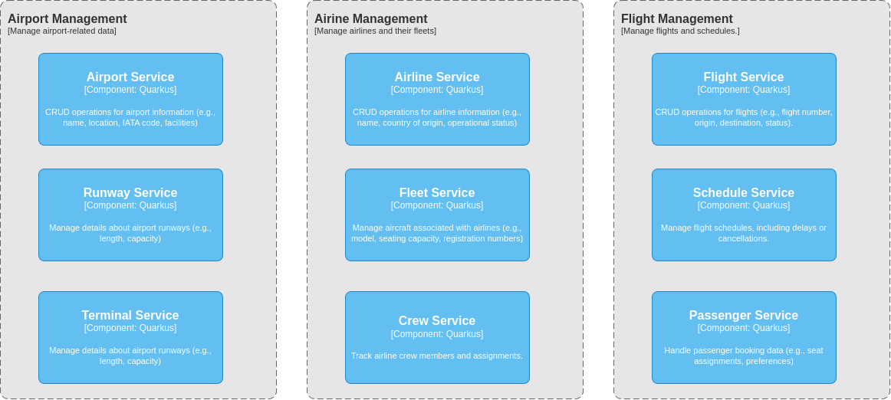
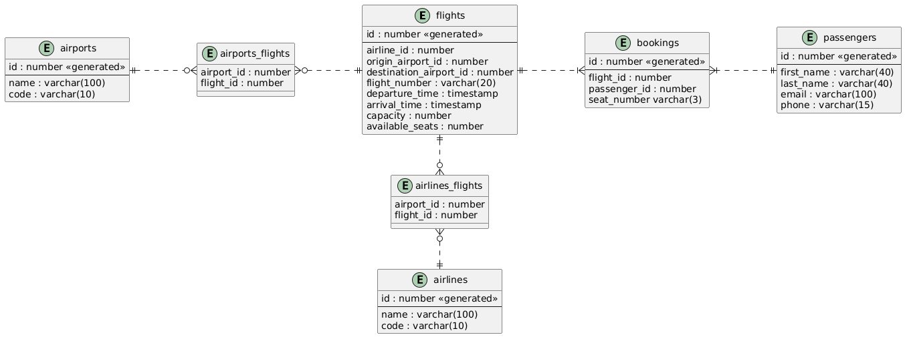
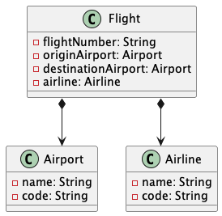

= Flight Management System
:sectnums:
:sectnumlevels: 3

== Introduction

The purpose of this project is to develop a flight management system that showcases
the implementation of microservices architecture using Java, Quarkus, and Kubernetes.
The flight management system is designed to simulate a simplified version of a
real-world flight booking and management system. It allows users to search for available
flights, make reservations, and manage bookings.

== Architecture Overview

=== Database ER Diagram

=== Class Diagram

