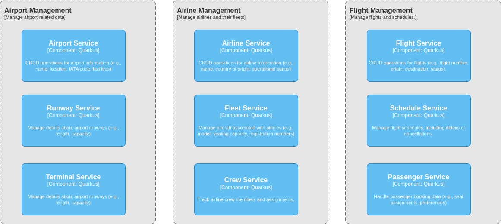

= Flight Management System
:sectnums:
:sectnumlevels: 3

== Introduction

The purpose of this project is to develop a airport management system that showcases
the implementation of microservices architecture using Java, Quarkus, and Kubernetes.
The airline management system is designed to simulate a simplified version of a
real-world airport management system. It allows airport staff to manage airports, airlines, and flights.

== Architecture Overview

=== Context Diagram

image::docs/context-diagram.png[Context Diagram]

=== Container Diagram

