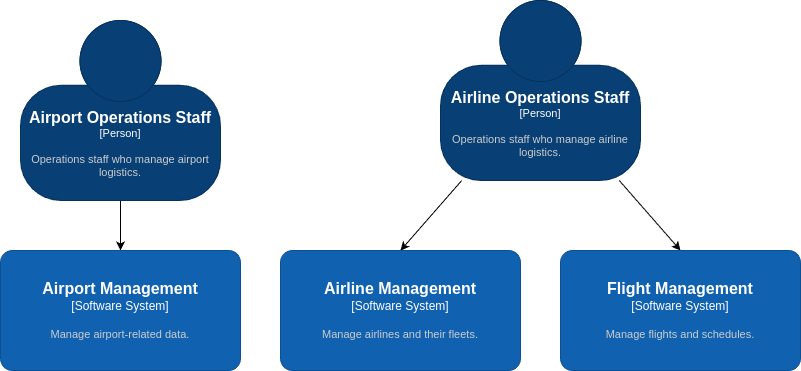
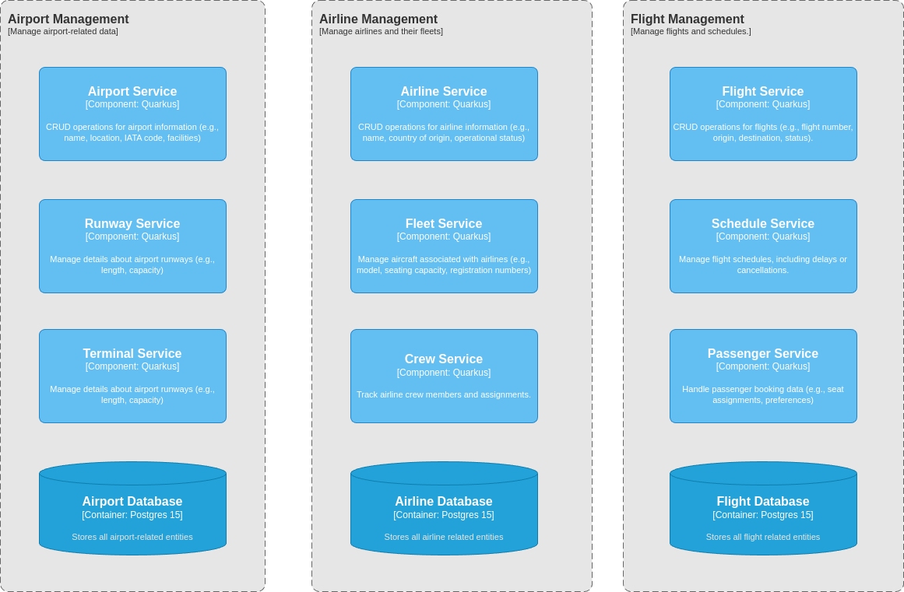

= Flight Management System
:sectnums:
:sectnumlevels: 3

== Introduction

The purpose of this project is to develop a airport management system that showcases
the implementation of microservices architecture using Java, Quarkus, and Kubernetes.
The airport management system is designed to simulate a simplified version of a
real-world airport management system. It allows airport staff to manage airports, 
airlines, and flights.

== System Overview
The *Airport Management System* comprises several key modules and services to
manage airport operations, including airport-related data, runway details, 
terminal information, airline management, flight management and crew assignments. 
The system integrates these services to provide a centralized platform for managing
complex airport functions, all built using the Quarkus framework, with a PostgreSQL
database backend.

=== Key Components
1. Airport Management
   * *Purpose*: Manages overall airport-related data such as the airport's name, 
      location, IATA code, and facilities.
   * *Technology*: Quarkus

=== Context Diagram

=== Container Diagram

